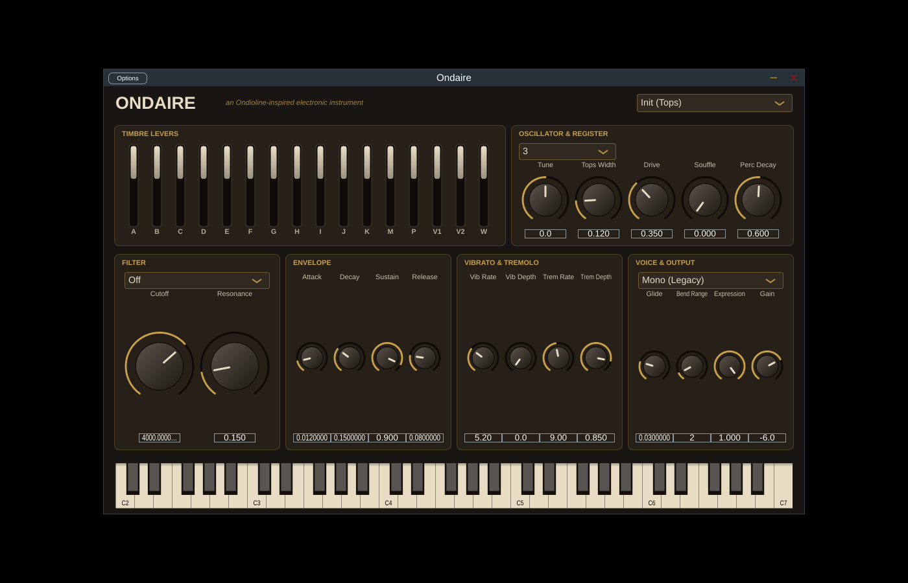

# Ondaire

**An Ondioline-inspired software instrument (VST3 / Standalone), built with JUCE.**

The Ondaire is an emulation of Georges Jenny's **Ondioline** (1941), one of the
first expressive monophonic electronic instruments. Its architecture follows
Jenny's own construction manual (*"L'Ondioline — initiation à la lutherie
électronique"*, Toute la Radio), which describes the complete signal path:
a cathode-coupled multivibrator oscillator, an octave-transposing register
switch, a pressure-sensitive "progressive attack" keyboard, a percussion
(plucked string) circuit, automatic and manual vibrato, and a bank of timbre
levers feeding resonant "formant" circuits.



## Architecture: manual → plugin

| Ondioline (manual) | Ondaire |
| --- | --- |
| Multivibrator delivering negative "tops" (pulses) at the cathode or rectangular waves at the anode | Band-limited (PolyBLEP) pulse oscillator; lever **B** selects square, the *Tops Width* knob sets the pulse width |
| *Clé d'octaves* — 3-octave keyboard transposed octave-by-octave over registers 1–4 | **Octave Key (Register)** switch, 4 positions |
| *Bouton d'accord général* (master tuning potentiometer) | **Tune** (±100 cents) |
| *Boîte d'attaque progressive* — loudness follows key pressure | Velocity shapes attack time and level; channel aftertouch swells the sound |
| *Inverseur de percussion* (lever **P**) — capacitor discharge gives a plucked-string envelope | Lever **P** + **Perc Decay** knob (guitar, harpsichord, banjo patches) |
| Preamp pentode 6BA6; lever **A** bypasses it to avoid its distortion | **Drive** knob (soft clipping); lever **A** defeats it |
| Lever **C** — low-pass that blunts the exciting impulse | One-pole low-pass |
| Lever **F** — small series capacitor that sharpens the impulse | One-pole high-pass |
| Resonator coils **G** and **H** tuned by capacitor levers **E, I, J, K** ("formants") | Two resonant band-pass circuits; engaged capacitor levers lower the formant frequency, caps without a coil act as tone-loading low-pass |
| Lever **M** — string-tap percussion (castanets, "avec corde" effects) | Noise chiff transient at note start |
| Lever **D** — LFO chops the pentode screen (mandolin/banjo repetition) | Chopped tremolo; **Trem Rate/Depth** knobs |
| Automatic vibrato oscillator (3–10 Hz), levers **V1/V2** (depth) and **W** (speed) | Same lever behavior, plus modern **Vib Rate/Depth** knobs |
| Manual vibrato via the laterally-oscillating sprung keyboard | **Pitch wheel** (configurable bend range, default ±2 semitones), mod wheel adds vibrato |
| *Genouillère d'expression* (knee lever volume) | **Expression** knob, also driven by MIDI CC 11 / CC 2 |
| Monophonic with silent-at-rest oscillator ("rupteur de silence") | **Mono (Legacy)** mode with last-note priority, legato and glide — or modern **Poly** (8 voices) |
| — (modern additions) | Resonant **LP / HP / BP** state-variable filter, full **ADSR**, glide, host automation of every parameter |

## Factory presets

The 30 programs come from **Tableau III — Liste des timbres** in the manual,
using the lever combinations Jenny published: *Violon* (A F), *Flûte* (G J),
*Clarinette* (B G I), *Hautbois* (F H I J), *Saxophone Alto* (C G I J),
*Trompette Jazz* (G I J), *Clavecin* (H P), *Banjo* (D F G I J),
*Cornemuse* (F G), *Contrebasse à corde* (A B C E F), and so on.

## MIDI control

Every parameter is exposed to the host for automation. In addition the
following MIDI controllers are wired directly:

| MIDI | Function |
| --- | --- |
| Pitch wheel | Pitch bend (range set by **Bend Range**, 1–12 semitones) |
| CC 1 (mod wheel) | Adds vibrato depth (up to +50 cents) |
| CC 2 / CC 11 | Expression — the knee lever |
| Channel/poly aftertouch | Swells loudness and vibrato (progressive-attack behavior) |
| CC 64 | Sustain pedal |
| CC 71 | Adds filter resonance |
| CC 74 | Sweeps filter cutoff ±2 octaves around the knob value |
| CC 120 / 123 | All sound / notes off |

## Building

Requires CMake ≥ 3.22 and a C++17 compiler. JUCE 8 is fetched automatically
(set `-DJUCE_SOURCE_DIR=/path/to/JUCE` to use a local copy).

```sh
cmake -B build -DCMAKE_BUILD_TYPE=Release
cmake --build build
```

Artifacts land in `build/Ondaire_artefacts/Release/`:

- `VST3/Ondaire.vst3` — the plugin
- `Standalone/Ondaire` — standalone app

On Linux, install the usual JUCE dependencies first
(`libasound2-dev libfreetype6-dev libfontconfig1-dev libx11-dev libxrandr-dev
libxinerama-dev libxcursor-dev libxext-dev libcurl4-openssl-dev
libgl1-mesa-dev libwebkit2gtk-4.1-dev libgtk-3-dev`).

### Engine smoke test

```sh
cmake --build build --target OndaireEngineTest
./build/OndaireEngineTest_artefacts/Release/OndaireEngineTest
```

Renders every factory preset offline and checks the output is audible, finite
and returns to silence after release.

## License note

This project uses the JUCE framework, which is available under the AGPLv3 (or
a commercial JUCE license). The Ondioline itself, its circuits and Georges
Jenny's patents are long in the public domain; this is an homage, not a
product of the original maker.
